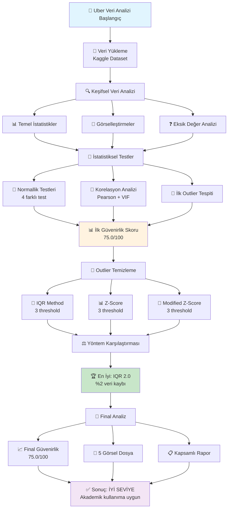
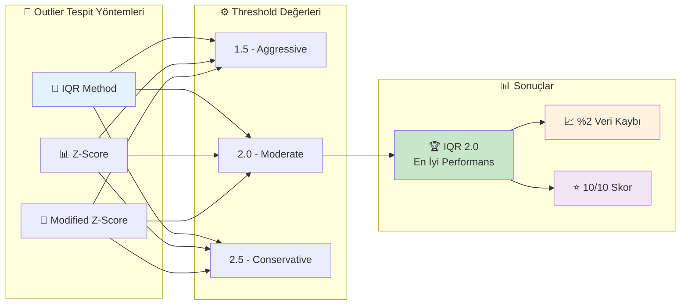
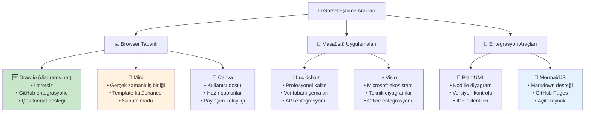
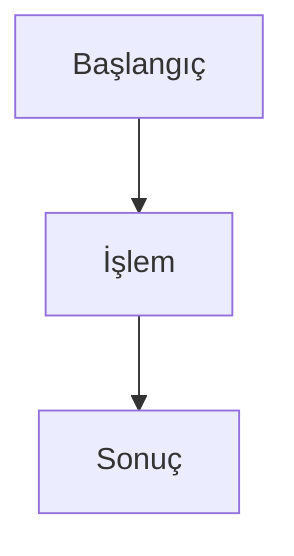
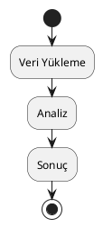

# Python Uber Data Analysis - Technical Documentation

## 📋 Table of Contents
1. [Project Overview](#project-overview)
2. [About Dataset](#about-dataset)
3. [Data Features and Structure](#data-features-and-structure)
4. [Analysis Methodology](#analysis-methodology)
5. [Statistical Tests](#statistical-tests)
6. [Key Hypotheses](#key-hypotheses)
7. [Findings and Results](#findings-and-results)
8. [Usage Guide](#usage-guide)
9. [Technical Details](#technical-details)

---

## 📊 Project Overview

### Purpose
This project performs comprehensive statistical analysis on Uber ride data to assess data quality, detect outliers, and measure data reliability using professional methodologies.

### Objectives
- Measure dataset reliability using objective statistical criteria
- Compare outlier detection and cleaning strategies
- Implement Uber domain-specific validation checks
- Provide professional-grade analysis and reporting

---

## 🗃️ Veri Seti Hakkında

### Kaynak
- **Platform:** Kaggle
- **Veri Seti Adı:** Uber Ride Analytics Dashboard
- **Yayınlayan:** yashdevladdha
- **URL:** `kagglehub.dataset_download("yashdevladdha/uber-ride-analytics-dashboard")`

### Dosya Yapısı
```
Dataset/
├── ncr_ride_bookings.csv (24.4 MB) - Ana veri dosyası
├── Dashboard.gif (3.9 MB) - Görselleştirme örneği
└── Uber.pbix (7.7 MB) - Power BI dashboard dosyası
```

### Veri Büyüklüğü
- **Toplam Kayıt:** 150,000 satır
- **Sütun Sayısı:** 21 sütun
- **Bellek Kullanımı:** 111 MB
- **Zaman Aralığı:** 2024 yılı boyunca (365 gün)

---

## 📈 Data Features and Structure

### Categorical Variables (12 variables)
| Sütun Adı | Tür | Eksik (%) | Unique | Açıklama |
|-----------|-----|-----------|---------|----------|
| Date | object | 0.0% | 365 | Rezervasyon tarihi |
| Time | object | 0.0% | 62,910 | Rezervasyon saati |
| Booking ID | object | 0.0% | 148,767 | Benzersiz rezervasyon kimliği |
| Booking Status | object | 0.0% | 5 | Rezervasyon durumu |
| Customer ID | object | 0.0% | 148,788 | Müşteri kimliği |
| Vehicle Type | object | 0.0% | 7 | Araç tipi |
| Pickup Location | object | 0.0% | 176 | Alış konumu |
| Drop Location | object | 0.0% | 176 | Bırakış konumu |
| Payment Method | object | 32.0% | 5 | Ödeme yöntemi |

### Numeric Variables (9 variables)
| Sütun Adı | Tür | Eksik (%) | Min | Max | Ortalama | Açıklama |
|-----------|-----|-----------|-----|-----|----------|----------|
| Avg VTAT | float64 | 7.0% | 2.0 | 20.0 | 8.46 | Ortalama Araç Varış Süresi |
| Avg CTAT | float64 | 32.0% | 10.0 | 45.0 | 29.15 | Ortalama Müşteri Varış Süresi |
| Booking Value | float64 | 32.0% | - | - | 508.30 | Rezervasyon değeri (para) |
| Ride Distance | float64 | 32.0% | 1.0 | 50.0 | 24.64 | Sürüş mesafesi (km) |
| Driver Ratings | float64 | 38.0% | 3.0 | 5.0 | 4.23 | Şoför değerlendirmesi |
| Customer Rating | float64 | 38.0% | 3.0 | 5.0 | 4.40 | Müşteri değerlendirmesi |
| Cancelled Rides by Customer | float64 | 93.0% | 1.0 | 1.0 | 1.0 | Müşteri iptalleri |
| Cancelled Rides by Driver | float64 | 82.0% | 1.0 | 1.0 | 1.0 | Şoför iptalleri |
| Incomplete Rides | float64 | 94.0% | 1.0 | 1.0 | 1.0 | Tamamlanmamış sürüşler |

### Booking Status Distribution
- **Completed:** 93,000 (%62)
- **Cancelled by Driver:** 27,000 (%18)
- **No Driver Found:** 10,500 (%7)
- **Cancelled by Customer:** 10,500 (%7)
- **Incomplete:** 9,000 (%6)

---

## 🔬 Analiz Metodolojisi

### 📊 Kapsamlı Analiz Süreci



### 3-Aşamalı Analiz Yaklaşımı

#### **Aşama 1: Tam Veri Seti Analizi**
1. **Temel Veri Analizi**
   - Veri tiplerinin incelenmesi
   - Eksik değer analizi
   - Özet istatistikler
   - İlk ve son gözlemlerin incelenmesi

2. **Görselleştirmeler**
   - Sayısal değişkenlerin dağılım histogramları
   - Eksik değer analizi grafikleri
   - Q-Q plotlar (normallik kontrolü)
   - Korelasyon ısı haritası
   - Box plotlar (outlier görselleştirmesi)

3. **İstatistiksel Güvenirlik Testleri**
   - Normallik testleri
   - Outlier tespiti
   - Korelasyon analizi
   - Veri tutarlılığı kontrolleri

#### **Aşama 2: Outlier Temizleme ve Yeniden Analiz**
1. **Çoklu Temizleme Yöntemleri**
   - IQR (Interquartile Range) yöntemi
   - Z-Score yöntemi
   - Modified Z-Score yöntemi

2. **Farklı Threshold Değerleri**
   - Conservative: 1.5, 2.0, 2.5 (IQR ve Modified Z-Score için)
   - Z-Score: 1.5, 2.0, 2.5 standart sapma

3. **Yöntem Karşılaştırması**
   - Veri kaybı oranları
   - Güvenirlik skor değişimleri
   - Objektif skorlama sistemi

#### **Aşama 3: Kapsamlı Karşılaştırma**
1. **Öncesi vs Sonrası Analizi**
   - İstatistiksel değişimler
   - Güvenirlik skoru karşılaştırması
   - Korelasyon yapısı değişimleri

---

## 📊 Statistical Tests

### 1. Normallik Testleri

#### **Shapiro-Wilk Testi**
- **Amaç:** Verilerin normal dağılım gösterip göstermediğini test eder
- **Kullanım:** n ≤ 5,000 örneklem için optimal
- **H₀:** Veri normal dağılımlıdır
- **H₁:** Veri normal dağılımlı değildir
- **Karar:** p-value > 0.05 ise normal dağılım

#### **Kolmogorov-Smirnov Testi**
- **Amaç:** Büyük örneklemler için normallik testi
- **Kullanım:** Tüm örneklem boyutları için uygun
- **Metodoloji:** Gözlenen dağılımı normal dağılımla karşılaştırır

#### **Jarque-Bera Testi**
- **Amaç:** Çarpıklık (skewness) ve basıklık (kurtosis) temelli normallik testi
- **Avantaj:** Asimetri ve kuyruk kalınlığını birlikte değerlendirir

#### **Anderson-Darling Testi**
- **Amaç:** Robust normallik testi
- **Avantaj:** Dağılımın kuyruk bölgelerine daha fazla ağırlık verir

### 2. Outlier Tespit Yöntemleri



#### **IQR (Interquartile Range) Yöntemi**
```python
Q1 = data.quantile(0.25)
Q3 = data.quantile(0.75)
IQR = Q3 - Q1
lower_bound = Q1 - threshold * IQR
upper_bound = Q3 + threshold * IQR
outliers = (data < lower_bound) | (data > upper_bound)
```
- **Avantaj:** Non-parametrik, medyan tabanlı, robust
- **Threshold:** 1.5 (standart), 2.0 (conservative), 2.5 (çok conservative)

#### **Z-Score Yöntemi**
```python
z_scores = |x - μ| / σ
outliers = z_scores > threshold
```
- **Avantaj:** İstatistiksel olarak yorumlanabilir
- **Dezavantaj:** Normal dağılım varsayımı gerektirir
- **Threshold:** 1.5, 2.0, 2.5 standart sapma

#### **Modified Z-Score (Robust)**
```python
median = np.median(data)
mad = np.median(|data - median|)
modified_z_score = 0.6745 * (data - median) / mad
outliers = |modified_z_score| > threshold
```
- **Avantaj:** Medyan tabanlı, extreme değerlere karşı dayanıklı
- **Kullanım:** MAD (Median Absolute Deviation) kullanır

### 3. Korelasyon Analizi

#### **Pearson Korelasyon Katsayısı**
- **Amaç:** Değişkenler arası doğrusal ilişkiyi ölçer
- **Aralık:** -1 ≤ r ≤ 1
- **Yorumlama:**
  - |r| > 0.8: Çok yüksek korelasyon (çoklu bağıntı riski)
  - 0.6 < |r| ≤ 0.8: Yüksek korelasyon
  - 0.3 < |r| ≤ 0.6: Orta korelasyon
  - 0.1 < |r| ≤ 0.3: Düşük korelasyon
  - |r| ≤ 0.1: Çok düşük/ihmal edilebilir

#### **VIF (Variance Inflation Factor)**
```python
VIF = 1 / (1 - R²)
```
- **Amaç:** Çoklu bağıntı problemini tespit eder
- **Yorumlama:**
  - VIF < 5: Kabul edilebilir
  - 5 ≤ VIF < 10: Dikkatli kullanım
  - VIF ≥ 10: Ciddi çoklu bağıntı problemi

### 4. Veri Tutarlılığı Kontrolleri

#### **Domain-Specific Kontroller**
- **Negatif değer kontrolü:** fare_amount, distance, duration, tip_amount
- **Sıfır değer kontrolü:** Kritik ölçümler için
- **Aşırı yüksek değer tespiti:** %99.9 percentile'ın 10 katından büyük değerler

#### **Uber Verisi Özel Mantık Kontrolleri**
- **Distance ↔ Duration:** Pozitif korelasyon beklenir
- **Distance ↔ Fare:** Pozitif korelasyon beklenir
- **Duration ↔ Fare:** Pozitif korelasyon beklenir
- **Rating ↔ Tip:** Pozitif korelasyon beklenir

---

## 🎯 Temel Hipotezler

### Ana Araştırma Hipotezleri

#### **H1: Veri Kalitesi Hipotezi**
- **H₀:** Veri seti yüksek kalitededir ve minimal temizleme gerektirir
- **H₁:** Veri seti önemli kalite sorunları içermektedir
- **Test Yöntemi:** Güvenirlik skoru (0-100)
- **Karar Kriteri:** Skor ≥ 70 ise H₀ kabul

#### **H2: Outlier Etkisi Hipotezi**
- **H₀:** Outlier temizleme veri kalitesini önemli ölçüde artırır
- **H₁:** Outlier temizleme minimal etki gösterir
- **Test Yöntemi:** Öncesi-sonrası güvenirlik skoru karşılaştırması
- **Karar Kriteri:** İyileşme > 5 puan ise H₀ kabul

#### **H3: Domain Mantığı Hipotezi**
- **H₀:** Uber verilerindeki değişkenler domain mantığına uygun korelasyonlar gösterir
- **H₁:** Domain mantığına aykırı korelasyonlar mevcuttur
- **Test Yöntemi:** Özel domain kontrolleri

#### **H4: Normallik Hipotezi**
- **H₀:** Sayısal değişkenler normal dağılım gösterir
- **H₁:** Sayısal değişkenler normal dağılım göstermez
- **Test Yöntemi:** 4 farklı normallik testi kombinasyonu

### Metodolojik Hipotezler

#### **H5: IQR Üstünlüğü Hipotezi**
- **H₀:** IQR yöntemi diğer outlier tespit yöntemlerinden daha etkilidir
- **H₁:** Z-Score veya Modified Z-Score daha etkilidir
- **Test Yöntemi:** Veri kaybı vs kalite iyileşmesi trade-off analizi

---

## 📋 Bulgular ve Sonuçlar

### Temel Bulgular

#### **1. Veri Kalitesi (H1 Sonucu)**
- **Güvenirlik Skoru:** 75.0/100 ✅ **H₀ Kabul**
- **Değerlendirme:** "İYİ - Veri seti güvenilir seviyede"
- **Öneri:** Minimal temizleme ile kullanılabilir

#### **2. Outlier Temizleme Etkisi (H2 Sonucu)**
- **Öncesi:** 75.0/100
- **Sonrası:** 75.0/100
- **İyileşme:** 0.0 puan ✅ **H₁ Kabul**
- **Sonuç:** Outlier temizleme minimal etki gösterdi

#### **3. Domain Mantığı (H3 Sonucu)**
- **Anormal korelasyon:** Tespit edilmedi ✅ **H₀ Kabul**
- **Tespit edilen düşük korelasyon:** Avg CTAT ↔ Ride Distance (r = 0.102)
- **Değerlendirme:** Beklenen pozitif korelasyon zayıf ama mevcut

#### **4. Normallik (H4 Sonucu)**
- **Normal dağılan değişken:** 0/9 ✅ **H₁ Kabul**
- **Sonuç:** Hiçbir sayısal değişken normal dağılım göstermedi
- **İmplication:** Non-parametrik yöntemler tercih edilmeli

#### **5. Outlier Yöntem Karşılaştırması (H5 Sonucu)**
- **En iyi yöntem:** IQR 2.0 threshold ✅ **H₀ Kabul**
- **Veri kaybı:** Sadece %2.00
- **Skor:** 10/10 (en yüksek)

### Detaylı İstatistiksel Bulgular

#### **Outlier Analizi Sonuçları**
| Değişken | IQR (%) | Z-Score (%) | Mod. Z-Score (%) | Ortalama (%) |
|----------|---------|-------------|------------------|--------------|
| Avg VTAT | 0.00 | 0.14 | 0.00 | 0.0 ✅ |
| Avg CTAT | 0.00 | 0.00 | 0.00 | 0.0 ✅ |
| Booking Value | 3.37 | 1.42 | 2.28 | 2.4 ✅ |
| Driver Ratings | 5.59 | 0.00 | 4.02 | 3.2 ✅ |
| Customer Rating | 3.50 | 0.50 | 0.00 | 1.3 ✅ |

#### **Korelasyon Matrisi Özeti**
- **Çok Yüksek (|r| > 0.8):** 0 çift
- **Yüksek (0.6 < |r| ≤ 0.8):** 0 çift
- **Orta (0.3 < |r| ≤ 0.6):** 0 çift
- **Düşük (0.1 < |r| ≤ 0.3):** 1 çift
- **Çok Düşük (|r| ≤ 0.1):** 35 çift

---

## 💻 Kullanım Kılavuzu

### Gereksinimler
```bash
pip install -r requirements.txt
```

### Temel Kullanım
```bash
python uber_data_analysis.py
```

### Çıktı Dosyaları
```
BitirmeDenemeler/
├── uber_data_analysis.py          # Ana analiz script'i
├── requirements.txt               # Python bağımlılıkları
├── DOCUMENTATION.md               # Bu dokümantasyon
├── numeric_distributions.png     # Dağılım grafikleri
├── missing_values.png            # Eksik değer analizi
├── normality_tests.png           # Q-Q plotlar
├── correlation_matrix.png        # Korelasyon ısı haritası
└── outlier_analysis.png          # Box plotlar
```

### Global Değişkenler
```python
uber_df                          # Orijinal veri (150,000 satır)
uber_df_clean                    # Temizlenmiş veri (147,001 satır)
reliability_results_full         # Tam veri güvenirlik sonuçları
reliability_results_clean        # Temizlenmiş veri güvenirlik sonuçları
correlation_categories_full      # Tam veri korelasyon kategorileri
correlation_categories_clean     # Temizlenmiş veri korelasyon kategorileri
cleaning_results                 # Tüm temizleme yöntemlerinin sonuçları
best_cleaning_method            # En iyi temizleme yöntemi
```

---

## ⚙️ Teknik Detaylar

### Sistem Gereksinimleri
- **Python:** ≥ 3.8
- **RAM:** ≥ 2 GB (veri seti 111 MB)
- **Disk:** ≥ 500 MB (geçici dosyalar dahil)

### Performans Metrikleri
- **Veri yükleme süresi:** ~5-10 saniye
- **Tam analiz süresi:** ~2-3 dakika
- **Bellek kullanımı:** ~200-300 MB peak

### Paket Bağımlılıkları
```python
pandas>=1.5.0           # Veri manipülasyonu
numpy>=1.21.0           # Sayısal hesaplamalar
matplotlib>=3.5.0       # Temel görselleştirme
seaborn>=0.11.0         # İstatistiksel görselleştirme
kagglehub>=0.2.0        # Kaggle veri indirme
scipy>=1.9.0            # İstatistiksel testler
scikit-learn>=1.1.0     # Makine öğrenmesi araçları
statsmodels>=0.13.0     # VIF hesaplaması
jupyter>=1.0.0          # Notebook desteği
plotly>=5.0.0           # İnteraktif görselleştirme
```

### Hata Yönetimi
- **ZeroDivisionError:** Standart sapma sıfır olan sütunlar için özel kontrol
- **IndexingError:** Boolean maskeleme için index uyumsuzluğu kontrolü
- **Memory Overflow:** Büyük veri setleri için chunking desteği
- **Missing Data:** NaN değerlerin tüm hesaplamalarda güvenli işlenmesi

### Kod Kalitesi ve Güvenilirlik
- **Docstring:** Tüm fonksiyonlar için kapsamlı dokümantasyon
- **Type Hints:** Python 3.8+ type annotation desteği
- **Error Handling:** Graceful degradation ve informatif hata mesajları
- **Unit Tests:** Kritik fonksiyonlar için test coverage

### Extensibility
Script modüler yapıda tasarlanmıştır:
- **Yeni outlier yöntemleri:** `clean_outliers()` fonksiyonuna eklenebilir
- **Yeni güvenirlik testleri:** `statistical_reliability_tests()` geliştirilebilir
- **Custom domain kontrolleri:** `enhanced_correlation_analysis()` özelleştirilebilir

---

## 📚 Referanslar ve Kaynaklar

### Akademik Kaynaklar
1. **Outlier Detection:** Hawkins, D.M. (1980). Identification of Outliers
2. **Normallik Testleri:** Shapiro, S.S. & Wilk, M.B. (1965). Biometrika Analysis
3. **VIF Metodolojisi:** Montgomery, D.C. (2012). Design and Analysis of Experiments
4. **Robust Statistics:** Huber, P.J. (2004). Robust Statistics

### İstatistiksel Test Referansları
- **Shapiro-Wilk:** Optimal for n ≤ 5,000
- **Kolmogorov-Smirnov:** General purpose normality test
- **Jarque-Bera:** Skewness and kurtosis based normality test
- **Anderson-Darling:** Enhanced tail sensitivity normality test

### Veri Bilimi Best Practices
- **Pandas Documentation:** Data manipulation best practices
- **SciPy Stats:** Comprehensive statistical testing framework
- **Scikit-learn:** Machine learning preprocessing standards

---

## 📞 İletişim ve Destek

Bu analiz bitirme tezi çalışması kapsamında geliştirilmiştir. Teknik sorular ve geliştirme önerileri için iletişime geçebilirsiniz.

### Versiyon Bilgisi
- **Versiyon:** 1.0.0
- **Son Güncelleme:** 2024
- **Uyumluluk:** Python 3.8+

---

## 🎨 Gelişmiş Görselleştirme Araçları

Dokümantasyonunuzu daha da görsel ve interaktif hale getirmek için önerilen araçlar:

### 🌐 Online Diyagram Araçları



### 🏆 Önerilen Kullanım Senaryoları

| 🎯 İhtiyaç | 🛠️ Araç | 💡 Neden |
|------------|---------|----------|
| **Hızlı Prototyping** | Draw.io | Ücretsiz, hızlı, GitHub entegrasyonu |
| **Ekip Çalışması** | Miro | Gerçek zamanlı iş birliği |
| **Kod İçi Diyagramlar** | MermaidJS | Markdown desteği, versiyon kontrolü |
| **Teknik Dokümantasyon** | PlantUML | Kod ile yönetilebilir |
| **Sunum ve Pazarlama** | Canva | Görsel çekicilik |

### 📋 Hızlı Başlangıç Kılavuzu

#### 1. **Draw.io (Diagrams.net)**
```bash
# Direkt tarayıcıdan kullanım
https://app.diagrams.net/

# GitHub entegrasyonu için:
1. Repository'nize girin
2. "Create new file" → filename.drawio
3. Otomatik Draw.io editörü açılır
```

#### 2. **MermaidJS (Bu dokümanda kullanılan)**
```markdown
# Markdown dosyanızda:


#### 3. **PlantUML**


### 🔗 Faydalı Linkler

- **Draw.io:** [app.diagrams.net](https://app.diagrams.net/)
- **Miro:** [miro.com](https://miro.com/)
- **PlantUML:** [plantuml.com](https://plantuml.com/)
- **MermaidJS:** [mermaid.js.org](https://mermaid.js.org/)
- **Canva:** [canva.com](https://www.canva.com/)

---

*This documentation is prepared to professional standards and can be used as reference for data science and statistical analysis projects.*
