# 🚗 Python Uber Data Analysis

> **Comprehensive Statistical Analysis:** Uber ride data quality assessment and outlier detection with multiple methodologies

[](https://python.org)
[](https://pandas.pydata.org)
[](LICENSE)

## 📊 Proje Akış Şeması

```mermaid
graph TD
    A["🚗 Uber Ride Analytics<br/>150,000 sürüş verisi"] --> B["🔍 Aşama 1: Tam Veri Analizi"]
    A --> C["🧹 Aşama 2: Outlier Temizleme"]
    A --> D["⚖️ Aşama 3: Karşılaştırmalı Analiz"]
    
    B --> B1["📊 Temel İstatistikler"]
    B --> B2["📈 Görselleştirmeler"]
    B --> B3["🔬 Güvenirlik Testleri"]
    B --> B4["🔗 Korelasyon Analizi"]
    
    C --> C1["📏 IQR Yöntemi<br/>(1.5, 2.0, 2.5)"]
    C --> C2["📊 Z-Score Yöntemi<br/>(1.5, 2.0, 2.5)"]
    C --> C3["🎯 Modified Z-Score<br/>(1.5, 2.0, 2.5)"]
    
    D --> D1["📋 Öncesi vs Sonrası"]
    D --> D2["⭐ Yöntem Etkinliği"]
    D --> D3["📝 Sonuç Raporlaması"]
    
    B1 --> E["🎯 Güvenirlik Skoru: 75.0/100"]
    B2 --> F["📁 5 Görsel Dosya"]
    B3 --> G["🧪 4 Normallik Testi"]
    B4 --> H["🔍 1 Düşük Korelasyon"]
    
    C1 --> I["🏆 En İyi: IQR 2.0"]
    C2 --> I
    C3 --> I
    
    I --> J["✅ Veri Kaybı: %2.00<br/>Minimal İyileşme"]
    
    style A fill:#e1f5fe
    style E fill:#c8e6c9
    style I fill:#fff3e0
    style J fill:#f3e5f5
```



## 🎯 Project Overview

This project performs comprehensive statistical analysis on **150,000** Uber ride records:
- ✅ **Data quality assessment** using objective statistical criteria
- 🧹 **Comparative analysis** of 9 different outlier detection methods  
- 📊 **Reliability scoring** with professional-grade reporting
- 🎯 **Domain-specific** validation and logic checks

## 🚀 Quick Start

### 1. Installation
```bash
git clone [repo-url]
cd python-uber-analysis
pip install -r requirements.txt
```

### 2. Run Analysis
```bash
python uber_data_analysis.py
```

### 3. Results
- 📊 **Reliability Score:** 75.0/100 (Good level)
- 🧹 **Best method:** IQR 2.0 threshold
- 📉 **Data loss:** Only 2.00%
- 🔗 **Correlation:** 1 low correlation detected

## 📋 Dataset Information

| 📊 Feature | 📈 Value |
|------------|----------|
| **Source** | Kaggle - Uber Ride Analytics Dashboard |
| **Size** | 150,000 rows × 21 columns |
| **Memory** | 111 MB |
| **Time Range** | Full year 2024 (365 days) |
| **Missing Data** | 35.67% |

### Key Variables
- 🕐 **Time:** Date, Time
- 📱 **Booking:** Booking ID, Status, Customer ID
- 🚗 **Ride:** Vehicle Type, Pickup/Drop Location
- ⏱️ **Performance:** Avg VTAT, Avg CTAT
- 💰 **Financial:** Booking Value, Payment Method
- 📏 **Distance:** Ride Distance
- ⭐ **Rating:** Driver/Customer Ratings

## 🔬 Analysis Methodology

### 3-Phase Approach

```mermaid
flowchart LR
    subgraph "📊 Veri Seti"
        A["150,000 satır<br/>21 sütun<br/>111 MB"]
        A1["📅 Kategorik: 12"]
        A2["🔢 Sayısal: 9"]
        A --> A1
        A --> A2
    end
    
    subgraph "🔬 İstatistiksel Testler"
        B1["🧪 Normallik Testleri<br/>• Shapiro-Wilk<br/>• Kolmogorov-Smirnov<br/>• Jarque-Bera<br/>• Anderson-Darling"]
        B2["🎯 Outlier Tespiti<br/>• IQR Method<br/>• Z-Score<br/>• Modified Z-Score"]
        B3["🔗 Korelasyon<br/>• Pearson<br/>• VIF Analysis<br/>• Domain Checks"]
    end
    
    subgraph "📈 Sonuçlar"
        C1["✅ Güvenirlik: 75/100<br/>(İYİ SEVIYE)"]
        C2["🧹 En İyi: IQR 2.0<br/>(%2 veri kaybı)"]
        C3["📊 Normal Dağılan: 0/9<br/>(Non-parametrik önerilir)"]
        C4["🔍 Düşük Korelasyon: 1<br/>(Avg CTAT ↔ Distance)"]
    end
    
    A --> B1
    A --> B2
    A --> B3
    
    B1 --> C3
    B2 --> C2
    B3 --> C4
    
    C1 --> D["🎓 Akademik Kullanım<br/>Hazır"]
    C2 --> D
    C3 --> D
    C4 --> D
    
    style A fill:#e3f2fd
    style C1 fill:#c8e6c9
    style C2 fill:#fff3e0
    style D fill:#f3e5f5
```



#### 🔍 Phase 1: Full Data Analysis
- Descriptive statistics
- Data visualizations
- Reliability testing
- Correlation analysis

#### 🧹 Phase 2: Outlier Detection
- **IQR Method** (1.5, 2.0, 2.5 thresholds)
- **Z-Score Method** (1.5, 2.0, 2.5 thresholds)
- **Modified Z-Score** (1.5, 2.0, 2.5 thresholds)

#### ⚖️ Phase 3: Comparative Analysis
- Before vs after evaluation
- Method effectiveness scoring
- Results reporting

## 📊 Statistical Tests

### Normality Tests
- **Shapiro-Wilk** (n ≤ 5,000)
- **Kolmogorov-Smirnov** (general purpose)
- **Jarque-Bera** (skewness/kurtosis)
- **Anderson-Darling** (robust)

### Outlier Detection
- **IQR:** Non-parametric, robust ✅
- **Z-Score:** Parametric, fast
- **Modified Z-Score:** Median-based, robust

### Correlation Analysis
- **Pearson correlation** (-1 ≤ r ≤ 1)
- **VIF analysis** (multicollinearity)
- **Domain checks** (Uber-specific)

## 🎯 Key Findings

### ✅ Data Quality
```
Reliability Score: 75.0/100
Status: ✅ GOOD LEVEL
Recommendation: Minimal cleaning sufficient
```

### 🧹 Outlier Cleaning
```
Best Method: IQR 2.0
Data Loss: 2.00%
Impact: Minimal improvement
```

### 📈 Correlation Findings
```
High Correlation: 0 pairs ✅
Low Correlation: 1 pair
└─ Avg CTAT ↔ Ride Distance: r=0.102
```

### 🎲 Normality Results
```
Normal Distribution: 0/9 variables
Implication: Non-parametric methods recommended
```

## 📁 Output Files

```
📂 Results/
├── 📊 numeric_distributions.png    # Distribution plots
├── 📉 missing_values.png          # Missing value analysis
├── 📈 normality_tests.png         # Q-Q plots
├── 🔥 correlation_matrix.png      # Correlation heatmap
├── 📦 outlier_analysis.png        # Box plots
└── 📋 DOCUMENTATION.md            # Detailed documentation
```

## 💻 Available Data Objects

After analysis, these data objects are available:

```python
# Main datasets
uber_df              # 150,000 rows - Original
uber_df_clean        # 147,001 rows - Cleaned

# Result objects
reliability_results_full      # Full data reliability tests
reliability_results_clean     # Cleaned data reliability tests
correlation_categories_full   # Correlation categories
cleaning_results             # All cleaning method results
```

## 🎓 Academic Value

### Research Benefits
- ✅ **Methodological Rigor:** 9 method comparison
- ✅ **Transparent Process:** Each phase separately reported
- ✅ **Objective Criteria:** Numerical reliability scores
- ✅ **Domain Knowledge:** Industry-specific validations
- ✅ **Reproducibility:** Complete code and documentation

### Use Cases
- 📊 **Data Quality Assessment**
- 🔬 **Methodology Documentation**
- 📈 **Findings and Discussion**
- 🎯 **Results and Recommendations**

## 🔧 Technical Features

### System Requirements
- **Python:** 3.8+
- **RAM:** 2GB+
- **Runtime:** ~2-3 minutes

### Reliability Features
- ✅ Error handling
- ✅ Memory-safe operations
- ✅ Robust statistics
- ✅ Validated algorithms

## 📚 Documentation

For detailed technical documentation: **[DOCUMENTATION.md](DOCUMENTATION.md)**

Contents:
- 📋 Dataset details
- 🔬 Statistical test explanations
- 🎯 Hypothesis formulations
- 📊 Findings and interpretations
- 💻 Usage guide

## 🎉 Conclusion

This analysis demonstrates that Uber ride data can be analyzed at professional standards with a **75% reliability score**. The **IQR 2.0** method provides effective cleaning with minimal data loss (2%).

---

## 🎨 Görselleştirme ve Diyagram Araçları

Bu dökümanları daha da geliştirmek için önerilen araçlar:

### 🏆 En İyi Seçenekler

| 🛠️ Araç | 💰 Fiyat | 🎯 En İyi Kullanım | 🔗 Link |
|----------|----------|-------------------|---------|
| **Draw.io** | 🆓 Ücretsiz | GitHub entegrasyonu, teknik diyagramlar | [app.diagrams.net](https://app.diagrams.net/) |
| **Miro** | 💳 Freemium | Ekip çalışması, brainstorming | [miro.com](https://miro.com/) |
| **MermaidJS** | 🆓 Ücretsiz | Kod içi diyagramlar, markdown | [mermaid.js.org](https://mermaid.js.org/) |
| **Canva** | 💳 Freemium | Sunum ve pazarlama materyalleri | [canva.com](https://www.canva.com/) |

### 💡 Hızlı Başlangıç

Bu README'de gördüğünüz diyagramlar **MermaidJS** ile oluşturuldu. GitHub'da otomatik olarak render edilir!

```markdown
# Kendi diyagramınızı oluşturmak için:

```mermaid
graph TD
    A[Başlangıç] --> B[İşlem]
    B --> C[Sonuç]
```


---

**📧 Contact:** Data science project for educational purposes  
**📄 License:** MIT License  
**🔄 Version:** 1.0.0
